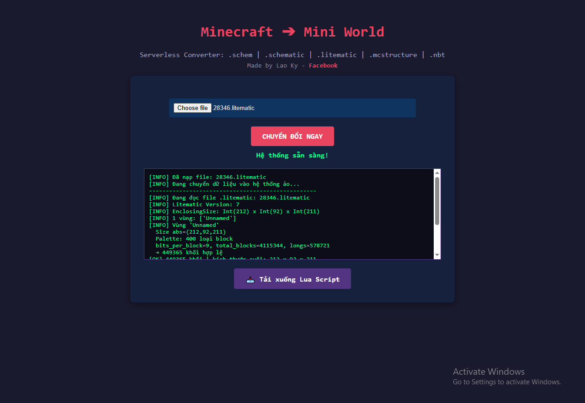
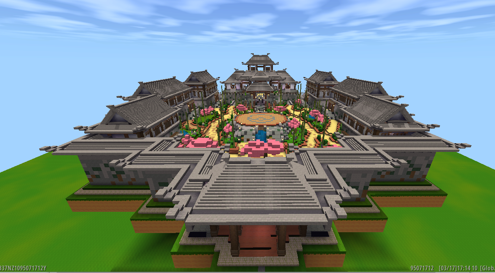

# Mini World Building Tool

Đây là một công cụ hỗ trợ xây dựng trong game Mini World, giúp người chơi tối ưu hóa quá trình thiết kế và xây dựng công trình của mình.

## Bản Demo trực tuyến
Bạn có thể truy cập và sử dụng công cụ ngay tại đây:
[https://laoky.github.io/Mini-World-Building-Tool/](https://laoky.github.io/Mini-World-Building-Tool/)

---

## Tính năng chính
* **Giao diện trực quan:** Dễ dàng sử dụng trên cả PC và điện thoại.
* **Tính toán nhanh:** Hỗ trợ các công thức tính toán vật liệu xây dựng.
* **Tương thích:** Chạy mượt mà trên mọi trình duyệt hiện đại.
* **Chức năng:** Nó sẽ biên dịch các tệp như .schem/.schematic/.litematic/.mcstructure/.nbt sang lua script trong Mini World

## Hướng dẫn sử dụng
1. Truy cập vào đường dẫn demo phía trên.
2. Chọn loại công trình hoặc công cụ bạn muốn sử dụng.
3. Nhập các thông số cần thiết.
4. Nhấn "Bắt đầu" hoặc "Tính toán" để xem kết quả.

## Công nghệ sử dụng
* **HTML5:** Cấu trúc nội dung.
* **CSS3:** Giao diện và hiệu ứng (Responsive Design).
* **JavaScript:** Xử lý logic và tính toán.

---

## Ảnh chụp màn hình

## Tác giả
* **LaoKy** - [Hồ sơ GitHub](https://github.com/laoky)

---
*Cảm ơn bạn đã sử dụng công cụ! Nếu thấy hay, đừng quên để lại 1 ⭐ cho Repository này nhé.*
